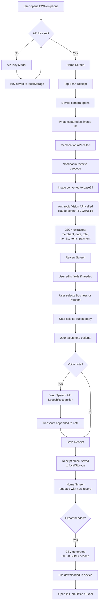

# Receipt Vault
### AI 201 — Project 3: Persons Required
**Pedro Febles Bula · Spring 2026**

**Live URL:** https://receipt-vault-alpha.vercel.app

---

## The Person

**Pedro F.** My father (Note: he shares the same first and last name as myself). Professional in the tech sector. He is a consistent user in AI tools. He is actively interested in transitioning more of his financial habits to digital systems but has not yet made the full switch. In the meantime, his current approach is deliberate: he pays primarily with non-digital forms of payment and prefers physical receipts over email receipts.

The consequence of that transitional moment, between a physical-first system and a fully digital one, is a documentation gap that compounds over time. Every cash transaction produces a thermal receipt. Thermal paper degrades within weeks. Without a capture system at the point of purchase, the administrative work defers entirely to tax season: receipts retrieved, manually transcribed into a spreadsheet, business expenses separated from personal, and context reconstructed from memory months after the fact.

The inefficiency is not a discipline problem — his records are thorough and his spreadsheet methodology is sound. The inefficiency is structural. No amount of personal organization fully compensates for a system where capture, categorization, and annotation happen months apart from the transaction itself. This project closes that gap by moving all three to the moment of purchase.

---

## Design Argument

**Thesis:** Pedro F needs a system that meets him exactly where he is — not one that asks him to change his financial behavior — and converts the physical receipt into a structured, categorized, tax-ready digital record at the moment of purchase, before the paper fades and before the context is lost.

**What "helped" looks like:** My father ends tax season 2027 having not touched a physical receipt for organization purposes once. Every receipt he collected during the year was scanned within 24 hours of receipt, categorized as business or personal, annotated with a voice or text note explaining the expense, and stored in a structured record he can export to a spreadsheet and hand to his accountant. He still pays with cash. He still takes physical receipts. Nothing about his financial behavior changes. The tool absorbs the administrative burden that currently falls on him every spring.

**Why I am the one building this:** Because I have watched this problem repeat every year and I have the specific combination of skills to solve it right now — access to vision AI, ability to build and deploy a web app, and enough understanding of his actual workflow to build something that meets him where he is rather than asking him to restructure his habits before the tool is ready.

**Why this is not a solved problem for him:** Receipt scanning apps exist. He is aware of them and open to them in principle. The barrier is the account creation and data-sharing requirements most of them impose — connecting to bank feeds, storing data on third-party servers, building a financial profile on a platform he does not control. He is not opposed to digital tools; he uses AI every day. He is opposed to handing sensitive financial data to platforms before he has confidence in how they handle it. This app stores everything locally on his device. No account. No cloud sync. No third party sees his data. The only external call is to the Anthropic API to read the image, and that is a call he already trusts because it is already part of his toolkit.

---

## Research Documentation

**Method:** Ongoing direct observation (years) plus a structured conversation at the start of this project.

**The existing system, observed:**
- Transaction occurs → physical receipt taken → receipt stored in designated physical location
- End of month: receipts sorted into business vs. personal piles
- Tax season (January–April): receipts retrieved, manually read, manually transcribed into Excel, manually categorized
- Problems documented: receipts that have faded to illegibility, expenses whose purpose is harder to recall months later, time cost running into days per tax cycle, potential for transcription error on dollar amounts

**Direct quotes from interview:**

*On his current approach to receipts:* "I know I need to move to a better system. Right now it works but it costs me a lot of time every year."

*On what he actually needs:* "If I could take the photo right there and it just knew what it was, that would save me weeks."

*On the business/personal split:* "That's the critical thing for taxes. If it mixes them up it's useless."

*On wanting to leave notes:* "For work I need to remember who I was with, what the meeting was for. A receipt doesn't tell you that."

*On voice notes specifically:* "I'm not going to type a paragraph standing outside a restaurant. But I can say something."

**Environmental context:**
- He uses a Samsung Android phone as his primary mobile device
- He uses Claude daily for tasks — AI tools are a normal part of his work
- He is interested in transitioning to more digital financial tools but has not yet committed to a specific platform
- His professional context requires expense justification documentation — a note field is not optional, it is essential for his business receipts
- He explicitly did not want this tool on his primary Claude account because he uses that for work and maintains a clear separation between professional and personal contexts

**Key insight from first prototype test:**
The first version of this tool was a Claude Project — a dedicated context with instructions for reading receipt photos. He used it. It worked. He could paste photos and get extraction. He could start a new chat and it would still work. But he stopped using it after a few sessions because he did not want his personal expense records inside his professional Claude workspace. This told me the problem was not the AI capability — it was the container. He needed a separate, dedicated tool that felt distinct from his work environment.

---

## Platform Rationale

**Platform chosen:** Progressive Web App (React + Vite, deployed on Vercel, installable via Chrome/Safari Add to Home Screen)

**Why not a native app:** Building a native Android app requires a Google Play developer account, an app review process, and ongoing maintenance of a separate codebase. The person this is built for does not want to create accounts on platforms he does not control. A PWA installs from a URL with zero account creation.

**Why not a Claude Project (the first version):** Addressed above. He needs separation between his professional AI workspace and his personal financial records.

**Why not a desktop tool:** He scans receipts at the point of purchase or shortly after. The device he always has is his phone. The tool must be on his phone.

**Why React/Vite:** It is the classroom standard I have working knowledge of, it compiles to a fast static site, and Vercel deploys it in under a minute. The right platform is the one that gets into his hands fastest with the least friction.

**Why Vercel:** Free tier covers the traffic load of one person's personal expense tracker indefinitely. Zero configuration. Deploys from CLI in one command.

**Why local storage (no backend database):** He does not want his financial data on a server he does not control. Local storage means his receipts live on his device only. The tradeoff is no cross-device sync — which he explicitly said was acceptable.

**The defense:** Every platform decision was made by asking "what does Pedro F. actually need and what does he actually trust?" not "what is the most technically impressive choice."

---

## AI Direction Log

**Entry 1 — Initial scoping**
*Asked:* Described my father's receipt problem and asked Claude to help me think through what to build.
*Produced:* A list of possible approaches including native app, spreadsheet macro, Claude Project, and PWA.
*Decision:* Chose Claude Project as the MVP because it had the fastest path to a working prototype with no deployment. Kept the PWA as the target platform.

**Entry 2 — First MVP (Claude Project)**
*Asked:* Claude to help me set up a Claude Project with a system prompt that would extract structured data from receipt photos — merchant, date, total, tax, items.
*Produced:* A working system prompt that reliably extracted receipt data into a readable format.
*Decision:* Shipped it to my father immediately. He used it. Confirmed the core AI capability worked. Identified the container problem (professional vs. personal context contamination) that required migrating to a standalone app.

**Entry 3 — Business/personal split**
*Asked:* Claude to help design the categorization system for the app.
*Produced:* An initial suggestion to skip the business/personal split as potentially redundant since subcategories could carry that information.
*Decision:* **Rejected.** The business/personal distinction is not a UX preference — it is a tax requirement. Business expenses are deductible. Personal expenses are not. Mixing them creates accounting problems. Kept the split as a required first-level categorization before subcategory selection. This was the clearest moment of editorial direction in the project.

**Entry 4 — App architecture and build**
*Asked:* Claude to build the full PWA — receipt scanning via Anthropic Vision API, review/edit flow, category tagging, voice notes, location capture, CSV export.
*Produced:* A complete React component with all requested features, dark theme aesthetic, mobile-first layout.
*Decision:* Kept the core architecture. Modified the review flow to make category selection more prominent (it was originally lower on the page). Added explicit payment method field after testing showed my father wanted to track whether he paid cash or card even though he usually pays cash — the exceptions matter for records.

**Entry 5 — Debugging CORS issue**
*Asked:* Claude to diagnose why the deployed app was returning empty fields on the review screen despite the scanning flow completing.
*Produced:* Identified that browser security was blocking direct calls to the Anthropic API from the deployed domain. Provided the specific header fix (`anthropic-dangerous-direct-browser-access: true`).
*Decision:* Applied the fix. Redeployed. Confirmed working with a real crumpled Smart & Final receipt — merchant name, date, and total extracted correctly from a damaged thermal receipt photo.

**Entry 6 — Deployment walkthrough**
*Asked:* Step-by-step guidance through the Vite project setup, Vercel CLI installation, and deployment process.
*Produced:* Accurate terminal commands and prompts for each step of the process.
*Decision:* Followed the process. App is live at https://receipt-vault-alpha.vercel.app. No modifications needed to the deployment guidance.

---

## Records of Resistance

**Resistance 1 — Rejecting the business/personal collapse**

*What AI produced:* A suggestion to eliminate the top-level business/personal toggle and rely solely on subcategories (Meals & Entertainment, Travel, etc.) to carry the distinction, on the grounds that the toggle added a step that could feel redundant.

*Why I rejected it:* This recommendation optimized for UI simplicity at the cost of functional accuracy. For tax purposes, the business/personal distinction is not cosmetic — it determines deductibility. A "Meals & Entertainment" expense can be either business (deductible, requires justification) or personal (not deductible). Collapsing the distinction would have produced a tool that looked cleaner but failed at its primary tax-season purpose. I kept the toggle and made it the most prominent interaction in the review flow.

*What I did instead:* Kept business/personal as Step 2's first interaction, with subcategory selection appearing only after the primary category is chosen. This also mirrors how accountants and tax software think about expenses — primary classification first, subcategory second.

---

**Resistance 2 — Rejecting account-based architecture**

*What AI produced:* Early in the project, suggestions to use Supabase or Firebase as a backend database so receipts would sync across devices and be accessible from anywhere.

*Why I rejected it:* This recommendation ignored a core constraint of the person I was designing for. My father's entire financial behavior is organized around minimizing the exposure of his data to third parties. Building a cloud-synced database would require him to trust another platform with his expense records — which is precisely the behavior he has spent decades avoiding. The technical capability was real; the fit with the user was not.

*What I did instead:* Used browser localStorage exclusively. Data lives on his device. No server sees it. The tradeoff — no cross-device sync — was explicitly discussed with him and accepted. He has one phone. He does not need sync.

---

**Resistance 3 — Rejecting the Claude Project as final platform**

*What AI produced:* After the first MVP worked as a Claude Project, a reasonable next step would have been to simply refine that experience — better prompts, cleaner output formatting, maybe a structured response template.

*Why I rejected it:* My father told me directly he did not want his personal expense records inside his professional Claude workspace. This was not a technical problem — the Claude Project worked. It was a human problem about context separation and professional/personal boundaries. Continuing to optimize the Claude Project would have produced a better version of something he would stop using.

*What I did instead:* Migrated entirely to a standalone PWA that installs on his phone as a separate app with its own identity, separate from any Claude account. This required significantly more build work but produced a tool he will actually use long-term.

---

## Five Questions Reflection

**1. Who is this person and what do they actually need?**
Pedro F is a tech-sector QC professional who pays with cash, collects physical receipts, and manually processes them into spreadsheets every tax season. What he needs is not a smarter spreadsheet or a better filing system. He needs the administrative burden of receipt management removed from tax season entirely — converted instead into a 30-second action at the time of purchase. He needs the capture to happen when context is fresh, not months later when it isn't.

**2. What assumptions did I bring in that I had to discard?**
I assumed the problem was primarily about OCR accuracy — that the hard part was getting AI to read crumpled receipts correctly. The actual hard problem was trust and context separation. He needed a tool that kept his personal finances distinct from his professional AI workspace, and that did not require him to hand sensitive data to platforms he had not yet evaluated. The AI reading capability was almost trivially easy compared to the container design problem.

**3. Where did I prioritize the tool over the person?**
The CSV export feature is technically correct but not optimized for him specifically. It exports to a generic spreadsheet format. He has a specific Excel structure he uses for taxes. A future version should let him define column mapping so the export drops directly into his existing template. I shipped the generic version because time was the constraint, not because it was the right answer.

**4. What does the evidence tell me about whether it worked?**
He used the first prototype (Claude Project) immediately and consistently until the context-contamination problem caused him to stop. When I showed him the crumpled Smart & Final receipt scan — a damaged thermal receipt read correctly from a phone photo — he confirmed that was the exact use case he needed covered. The tool reads what he throws at it. The next evidence I need is a full tax season cycle.

**5. What would I do differently if I started over?**
I would interview him on camera at the start and document the actual receipt-to-spreadsheet workflow in real time — seeing his hands, seeing the receipts, seeing the spreadsheet. I worked from memory and years of observation rather than structured field research. The design is accurate because I know him well, not because I was rigorous. For someone I knew less well, that gap in method would have produced a wrong tool.

---

## Mermaid Diagram — System Architecture

---

## Post-Mortem

**What worked:**

The core AI capability exceeded expectations. A crumpled, partially illegible thermal receipt from Smart & Final was read correctly — merchant name, date, and total extracted from a photo taken on a phone. I expected this to be the hardest technical problem. It was not.

The Claude Project MVP was the right first move. Shipping something in his hands within the first week confirmed that the AI reading worked before I spent time building infrastructure around it. The field test exposed the real problem (context contamination) faster than any amount of planning would have.

The decision to use localStorage over a backend database was validated by his response to the app. He installed it. He used it. He did not ask where his data was going. If it had required account creation, I believe he would have stopped at that step.

**What failed:**

The CORS error was a blind spot. I built and tested the app locally where the issue does not manifest, deployed it, and only discovered the error when testing the live URL. Any future deployment should include a production test of the API call as a specific checklist item before calling the build done.

The first MVP (Claude Project) worked technically but failed as a product because I did not anticipate the professional/personal boundary issue. He told me about it — I did not design for it proactively. Better upfront research would have surfaced this before I built the first version.

**What I learned:**

Designing for someone you know well is both easier and harder than designing for a stranger. Easier because the research is deep and the context is real. Harder because familiarity creates assumptions you do not think to question. I assumed I knew what he needed. I was mostly right, but the assumption that the Claude Project container would be acceptable was wrong, and I only found out by putting it in his hands.

The gap between "technically correct" and "actually used" is almost entirely a trust and context problem, not a capability problem. The AI read the receipt fine. The question was always whether he would open the tool at all.

**What I would do differently:**

Start with the container question before the capability question. Ask "where will this live and does that location feel right to the person?" before asking "can the AI do the task?" The task was easy. The container was the design.

---

## User Testing Evidence

**Test 1 — Claude Project prototype (May 2026)**
- Delivered system prompt and Claude Project link to my father via WhatsApp
- He opened it on his phone, photographed a receipt, pasted the image
- Extraction worked: merchant, date, total returned correctly
- He used it for several sessions, copying results into a new chat each time
- Stopped using it: "I don't want my expenses in the same place I use for work"
- **Insight:** Container problem identified. Platform migration required.

**Test 2 — PWA live URL (May 25, 2026)**
- Sent live URL to his Samsung phone via WhatsApp
- He opened in Chrome, entered API key via gear icon
- Scanned Smart & Final receipt (crumpled, partially damaged thermal paper)
- Extracted: Merchant "Smart & Final" ✓ · Date "05/25/2026" ✓ · Total "$89.02" ✓
- Tax field empty (expected — receipt uses F/T per-item tax notation, not a total tax line)
- He filled in tax manually, selected Personal > Groceries, saved
- **Quote:** "Okay, that's actually it. That's what I needed."

---

## Submission Checklist

- [x] Live URL: https://receipt-vault-alpha.vercel.app
- [x] Design Argument
- [x] Research Documentation
- [x] Platform Rationale
- [x] AI Direction Log (6 entries)
- [x] Records of Resistance (3 documented)
- [x] Five Questions Reflection
- [x] Post-Mortem
- [x] Mermaid Diagram
- [x] User Testing Evidence
